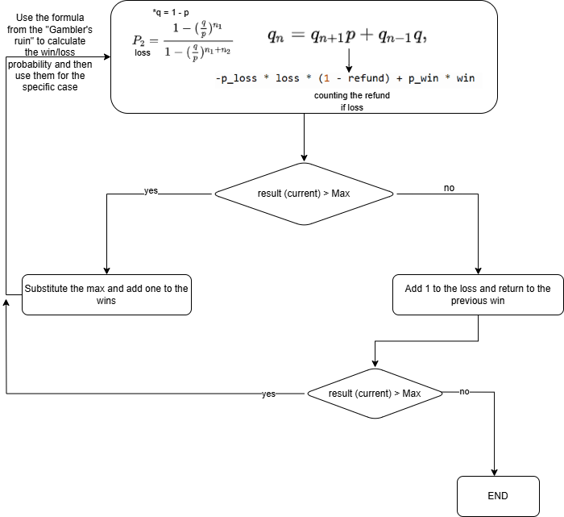

# Evidence-4-Demonstration-of-a-Programming-Paradigm-feedback

# Problem

Recent recessions have not been kind to entertainment venues, including the gambling industry.
Competition is fierce among casinos to attract players with lots of money, and some have begun to offer
especially sweet deals. One casino is offering the following: you can gamble as much as you want at
the casino. After you are finished, if you are down by any amount from when you started, the casino
will refund x% of your losses to you. Obviously, if you are ahead, you can keep all of your winnings.
There is no time limit or money limit on this offer, but you can redeem it only once.

For simplicity, assume all bets cost 1 dollar and pay out 2 dollars. Now suppose x is 20. If you
make 10 bets in total before quitting and only 3 of them pay out, your total loss is 3.2 dollars. If 6 of
them pay out, you have gained 2 dollars.

Given x and the percentage probability p of winning any individual bet, write a program to determine
the maximum expected profit you can make from betting at this casino, using any gambling strategy.

**Input**

The input consists of several test cases. A test case consists of the refund percentage x (0 ≤ x < 100)
followed by the winning probability percentage p (0 ≤ p < 50). Both x and p have at most two digits
after the decimal point.

**Output**

For each test case, display the maximum expected profit with an absolute error of at most 10−3.

# Diagram and Explanation

Here, the results are based on the user's input.

In the code, we first need a function to calculate the loss/win probability and return the profit based on the user's input. We need to use Gambler's Ruin formulas to do this (n1 = loss and n2 = win). The loss and win are the values we are going to use, one by one, starting at 1 for both values (we will explain how these values increase later). After the first part, we have the probabilities, but that's not enough for our problem. The expected profit for the case will be determined by our second formula, which we will adapt to our specific case, taking into account not only the probabilities of winning/losing and their respective win/loss values, but also the returned amount based on the loss.

Now, we are going to initialize best_win and loses with a value of 1, and best (the best profit currently) with 0.

For our first while loop, which will break if prev is 0 at the beginning of the loop, we are going to declare prev (previous profit) as 0. This will help us not only to start, but also to prevent an infinite loop if the next while is broken—by breaking its own while loop if the max has been reached. We also set wins to best_win (which is initially 1, but later helps us revert to the previous win if the next while is broken).

Next, we have another while loop inside the previous one. First, we calculate the profit based on the current wins and losses. If the profit is greater than the current best profit, then it replaces it, the current win becomes best_win, and we prepare for the next loop by redeclaring prev and increasing the win by one. If not, then the loop ends, and we return to the outer loop. If the previous win/loss combination was better, we finish everything, as we have already reached the maximum, and return the current best.

# Tests

the tests are written inside each file (python and racket), and the explanation is on the cases.txt, in which the formulas were used in each case, the result being the one marked as current.

# Complexity

The complexities are the same, as is the same code but in different languages (to use different paradigms):

Time complexity: O(n * m) → this is because the code depends on the wins and losses, because I used nested loops over these two.

Space complexity: O(1). As there is no recursion, nor scalar values.

# Paradigm

I used prolog (logic) and racket (functional).

Racket is far more suitable for numerical calculations, explicit control structures (like loops), and algorithmic logic such as optimizing profits. Prolog excels in declarative logic and symbolic reasoning, but in this case, it would be more of a limitation than a benefit.

Racket gives explicit control over loops, recursion, and conditions. This is useful for nested while loops and step-by-step optimization logic.

# References

Wikipedia contributors. (2025, 21 mayo). Gambler’s ruin. Wikipedia. https://en.wikipedia.org/wiki/Gambler%27s_ruin
